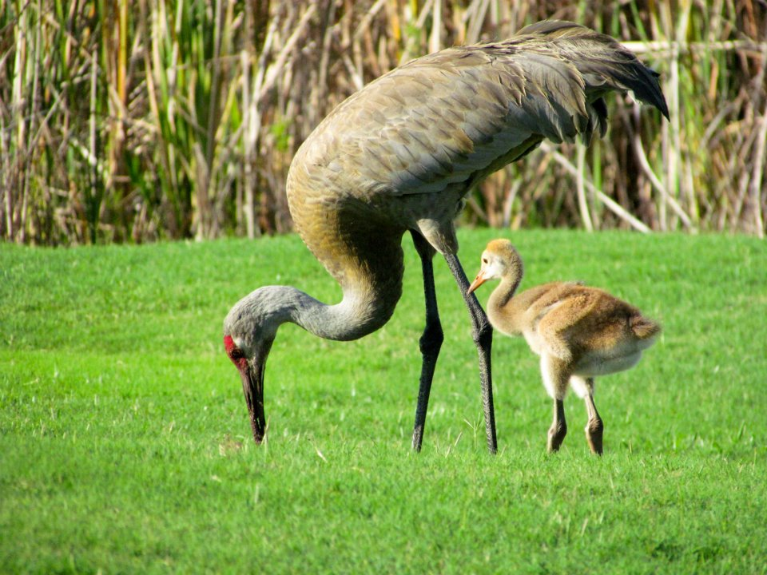

# (PART) Fundamental concepts and methods {-}

# Species-habitat association models: Mathematical models and statistical methods

> **JM: Some points of rationalle. **

> **1. I think we need a general term for the broad class of models examined. This term should not be biased towards a spatial distribution interpretation and neither should it be biased towards a habitat selection interpretation. I propose the more neutral *Species-Habitat Associations (SHA)* term.**

```
JF: I like this!
```

> **2. I think that the distinction between mathematical models and statistical methods is a central division, in the sense that baseline models can be defined for both of these categories and their potential extensions are more easily explained in these two distinct categories of (i) biology and (ii) inference. Indeed, our current book structure already follows this principle (section 1 covers the basics, section 2 covers biological extensions and section 3 covers statistical extensions). Therefore, I propose that we stucture this chapter around this fundamental division (see my split into APU and IPP sections below). Then, we can do the same with the basics chapters in Section 1 of the book and, naturally, the split of the extensions in Sections 2 and 3. What do you both think?**

```
What do you think about instead using 
"process" and "observation" models?  I'm not fully sure this captures 
what you are thinking here, but biolgoical processes are best modeled 
using mathematical/mechanistic models and statistical models provide a 
way to link mechanistic models to data by considering the observation 
processes.
```

## Objectives

The objectives of this chapter are to:

1. Introduce the aims of Species-Habitat Association (SHA) models and highlight the distinction between appropriate *mathematical models* that can formalise SHAs and the *statistical methods* that can be used to parameterise these models from field data. 

2. Outline the three necessary and sufficient ingredients of mathematical models for species-habitat associations: the *availability* of habitats in the environment, the usage of *habitats* in the wild and the underlying *preferences* for different habitats. The Availability-Preference-Use (APU) approach is a broad conceptual framework that both encompasses existing models [JF: or methods?] and can expand to incorporate more biological realism. 

```
APU or AUP (both hinted at here)?
```

3. Unveil commonalities and connections among different statistical approaches for quantifying species-habitat associations. In particular, *weighted distribution theory* and the *Inhomogeneous Poisson process (IPP)* provide suitable, overarching frameworks, encompassing nearly all widely used methods for modeling *species distributions* and *resource selection*. 

4. Given the importance of weighted distributions and the IPP model as unifiers of various seemingly disparate methods, we will describe, in simple terms, the main features of these frameworks and their biological and statistical assumptions. We will also emphasize simple methods for interpreting model parameters.  

> Could consider adding a roadmap here...something like the rough draft below

Part 2 of the book will be devoted to increasing the biological realism of our underlying models, allowing for more realistic links between habitat availability and habitat use (chapter 5) and considering the role of movement in determining habitat availability (Chapter 6).  We will then consider how density influences species-habitat associations and how species distributions, in turn, influence population demography (Chapter 7). Lastly, we will consider methods for addressing multi-species interactions (Chapter 8).

Part 3 of the book will address advanced statistical methods for addressing messy features of biological data, including spatial and temporal autocorrelation (Chapter 9), imperfect detectability (Chapter 11)[should this come first?], zero-inflation and overdispersion (Chapter 14). This section will also tackle challenges association with analyzing Big Data (Chapter), and methods for integrating multiple data types (chapter).


## Species-Habitat Association (SHA) models {#principles}

As discussed in Section \@ref(aims), the *ultimate goal* of most applications of SHA models is to better understand drivers of population abundance and distribution. In many cases, we hope to use these insights to predict population abundance or distribution in novel environments. In the broadest sense therefore, as with much of scientific endeavour, we are seeking understanding and predictive power. 

The *proximate goal* of most species distribution models is to link observed locations of plants or animals to a set of environmental covariates reflecting:

- resources (more is better)
- risks (less is better)
- environmental conditions (usually, abiotic variables characterised by a "Goldilocks zone" where very high/low values are unsuitable)
- non-biological proxies (for example indicators of absolute or relative position in space or time)

For example, we might model the distribution of sandhill crane locations  (*Antigone canadensis*)  as a function of the amount of surrounding grass and forbs (resources), a measure of visibility or cover (a determinant of predation risk), and mean daily maximum temperature (an environmental condition).

(ref:crane) [Sandhill Crane with Chick looking for food. Photo by Kyletracysrs.](https://commons.wikimedia.org/w/index.php?title=User:Kyletracysrs&action=edit&redlink=1) [Creative Commons Attribution-Share Alike 3.0 Unported license.](https://creativecommons.org/licenses/by-sa/3.0/deed.en)

(ref:crane2) Sandhill Crane with Chick looking for food. Photo by Kyletracysrs (https://commons.wikimedia.org/w/index.php?title=User:Kyletracysrs&action=edit&redlink=1) Creative Commons Attribution-Share Alike 3.0 Unported license.

```{r cranewithchick1, fig.cap="(ref:crane2)", echo=FALSE, fig.align='center', out.width="50%"}

```

A fully specified SHA model contains two fundamental parts. First, a *mathematical model* that expresses the expected density ($U$) of plants and animals as a function of a vector of environmental variables $\mathbf{X}={X_1,...,X_n}$ and, second, a *statistical model* that expresses how data may be produced from the process described by the mathematical model. 
In general, the mathematical model can be thought of as a function $f$ that takes values from the domain $\mathbb{X}$ and gives values in the range $\mathbb{U}$. 
\begin{equation}
U=f(\mathbf{X})\hspace{20mm} f:\mathbb{X}\to{\mathbb{U}}
\end{equation}

The domain, range and structure of the mathematical model can vary in their definition and complexity. To explore the scope of possible models for species-habitat associations, we look at each of these three aspects in turn. 


### The domain $\mathbb{X}$ 

Can be thought of environmentally, spatially and temporally. A spatial domain $\mathbb{G}$, or *G-space* may be defined in terms of latitude and longitude on a map (with the possible addition of altitude, or sea-depth as a third spatial dimension). Any subset of G-space is possible (e.g. resulting from the boundary of a particular study region). An environmental domain $\mathbb{E}$, or *E-space* may be defined in terms of continuous or discrete environmental variables. Examples of continuous variables include temperature, humidity, food abundance, predator abundance etc. Examples of discrete variables include pre-designed classifications of the environment into habitat classes (as is often done for the purposes of preparing pretty colour maps by Geographic Information Systems). A temporal domain $\mathbb{T}$, or *T-space* is defined as any subset of the real numbers signifying a time interval. Most habitat models are defined in $E$-space (so that, $\mathbb{X}=\mathbb{E}$). All purely spatial models (e.g. most geo-statistical or trend-fitting models) are defined in $G$-space (so that, $\mathbb{X}=\mathbb{G}$). Combinations of those spaces are, of course, possible and there are some examples (REFERENCES) of habitat models that account for residual spatial autocorrelation using spatial dimensions (so that, $\mathbb{X}=\mathbb{E}\cup\mathbb{G}$). The temporal dimension is occasionally employed to augment the domain (in the most complex case $\mathbb{X}=\mathbb{E}\cup\mathbb{G}\cup\mathbb{T}$), leading to the construction of dynamical SHA models (REFERENCES). Here are some increasingly fanciful possibilities of model domains:


### The range $\mathbb{U}$ 

```{r rsffail, echo=FALSE, fig.cap="Proportion of usage of habitat x as a function of proportional availability. Here, we have assumed that habitat x is preferred equally to all other habitats [JF: not sure what you mean here]. There is no doubt that when availability is 0, the habitat cannot be used, and when availability is 1 the organism cannot help but use it. However, it is not clear why proportional usage should increase in this gradual fashion from 0 to 1. Most organisms only need to use some habitats for a fixed amount of time. Alternative formulations for usage may exist, such as the example shown in grey, where the organism uses the habitat for around 20% of its time, unless it is forced not to by scarcity or super-abundance. Such models have rarely been considered in the literature."}

p<-seq(0,1,0.01)
q<-1-p
h1<-1
h2<-h1
u1<-h1*p/(h1*p+h2*q)
plot(p,u1, type="l", xlab="Proportion of habitat x in the environment", ylab="Usage of habitat x",lwd=2)

h1<-1/(.01+p)
h2<-4/(.02+q)
u1<-h1*p/(h1*p+h2*q)
lines(p,u1,col="gray",lwd=2)


```


where we have dropped the integral from eq \@ref(eq:wd) because it appears in both the numerator and denominator.  Now, noting that $f^a(s_1) = f^a(s_2)$ (if both locations are equally available), we get:
  
\begin{equation}
\frac{f^u(s_1)}{f^u(s_2)}  = \frac{\exp(3\beta_{elev})\exp(1.5\beta_{popD}+\beta_{wet})}{\exp(2\beta_{elev})\exp(1.5\beta_{popD}+\beta_{wet})} = \exp{\beta_{elev}}
\end{equation}

#Survey data preparation
##Load survey data

```{r domains, echo=TRUE}
computer<-"Geert"
if (computer=="Janjaap") path <- "d://WMR-INLA/data"
if (computer=="Geert") path<-"E:/GitHub/CoastalFish/fish_book/data/" 
if (computer=="Bruce") path<-"~/WMR-INLA/data"
    
library(INLA); library(fields); 
library(mgcv)
library(lattice); library(latticeExtra); library(grid); library(gridExtra);
library(rgdal); library(rgeos); 
library(mapdata); library(maptools)

dat<-read.csv(file.path(path,"fish/dfs/dfs4pmr_aco_ple.csv"))
names(dat)<-tolower(names(dat))
dat$date<-paste(dat$day,"/",dat$month,"/",dat$year)
dat$offset<-log(1/(dat$age1/dat$snumtot))
names(dat)[names(dat) == 'latitude_s'] <- 'lat'
names(dat)[names(dat) == 'longitude_s'] <- 'lon'
names(dat)[names(dat) == 'snumtot'] <- 'count'
dat$date<-as.POSIXct(strptime(dat$date,format="%d/%m/%Y"))

dat<-dat[is.na(dat$lat)==FALSE & is.na(dat$lon)==FALSE,]
dat$lat[dat$lat<0]<-(-1)*dat$lat[dat$lat<0]
dat$lon[dat$lon<0]<-(-1)*dat$lon[dat$lon<0]

head(dat)

```
After the aggregation (now that the length information is removed) we have rows in the data set.

To give an impression of the spatial properties of the data we plot it in a map. The surveys have different colors; black being the BTS hauls, red being the IBTS hauls in quarter 1, and blue being the IBTS hauls in quarter 3. The size of the circles indicate the counts in each haul.
```
```
Clearly the IBTS hauls cover a larger part of the North Sea, but the large catches are located in the same areas. 

### The count data

We plot a quick histogram of the counts to give us an impression of the statistical distribution of the data.


